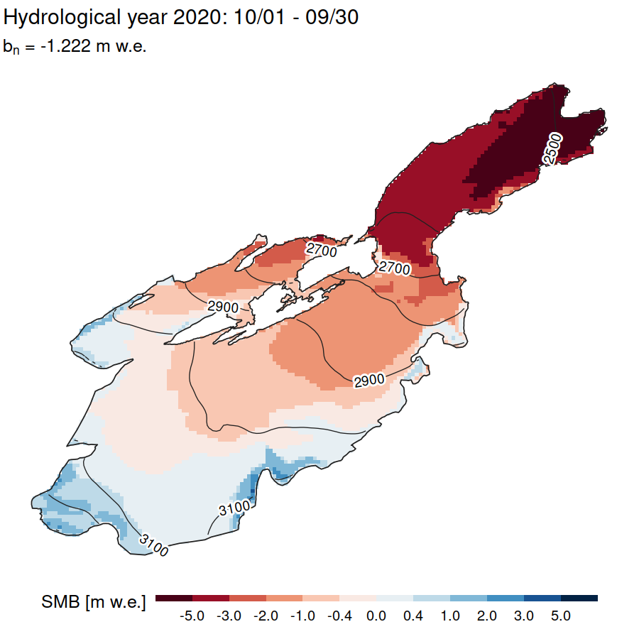

# Glacier mass balance model for interpolation of point measurements

The idea is to run a mass balance model (accumulation and radiation-corrected degree-day melt), optimizing the model parameters towards the best fit with a set of point mass balance measurements.

## Model description

We model at daily scale, one year at a time (typically from September Y-1 to September Y).

First we compute an initial snow distribution for the year, from snowline elevation and snow elevation gradient, and a distribution grid (function of curvature and elevation, as well as a process-based avalanche model (Gruber, 2007) and a correction based on winter snow probes if available).

Specifically, the initial snow distribution can be expressed as:

D_probes_norm * reduce(avalanche(D_curv_ele * D_tsl_snowgrad)) (1)

where\
**D_probes_norm** is the normalized distribution from IDW interpolation of the winter snow probes (only if available),\
**reduce()** is a function which optionally brings the distribution closer to the mean, to reduce variability,\
**avalanche()** is a function to simulate an avalanche (Gruber, 2007), with actual cell-wise downstream mass transport,\
**D_curv_ele** is a normalized grid computed from surface curvature plus an elevation cutoff for accumulation,\
**D_tsl_snowgrad** is the distribution from snow line elevation and a snow height gradient with altitude.

Then a daily accumulation and melt model is run, computing a gridded time series of cumulative mass balance.
Accumulation uses a temperature threshold to separate rain and snow; melt is computed with a radiation-enhanced temperature index model.
Snow distribution following each precipitation event (during the actual model run) is expressed as:

reduce(D_probes_norm) * reduce(D_curv_ele) * solid_fraction * distribute_precgrad_cutoff(correct(precipitation)), (2)\
while the avalanche is simulated at user-defined fixed dates of the year (typically end-of-winter and sometime in summer).

In (2),\
**reduce()** is as in (1), and can be used (with a custom reduction factor) in case snow probes are acquired on avalanche deposits, to avoid accounting twice for avalanche redistribution,\
**D_probes_norm** is as in (1),\
**D_curv_ele** is as in (1),\
**solid_fraction** is the solid fraction of each precipitation event, computed from temperature for each grid cell and each time-step,\
**distribute_precgrad_cutoff()** is a function which increases precipitation amount with altitude, up to a cutoff altitude,\
**correct()** is a function to correct for precipitation under-catch at the rain gauge, with the option to reduce the correction in summer (differential under-catch of snow and rain),\
**precipitation** is the rain gauge reading.

The model is iteratively tuned to stake readings with an optimization procedure, which minimizes bias over the stakes. If winter accumulation measurements are available, the model is first run over the winter and the precipitation parameters are optimized (currently the precipitation correction). Then the model is run over the whole period and the melt parameters are tuned to cancel the annual bias.

Finally, the computed mass balance is corrected in elevation bands to better match the stakes measurements.

NOTE in the mass balance plots: the effect of avalanches is included in the time series of accumulation, so that accumulation can theoretically be negative in case an avalanche takes snow away from the glacier (unlikely!)
